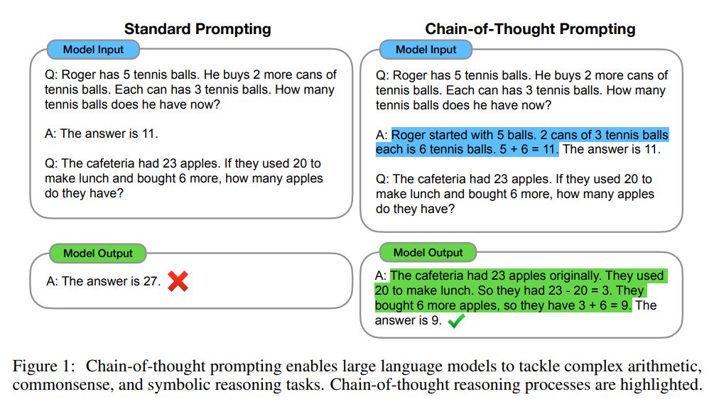

# This repo ceate AI-agent examples based on my Local LLM services

## Overview agent

### Chain of Thourght
In CoT [1], it combines the strengths of these two ideas in a way that avoids their limitations.
Specifically, we explore the ability of language models to perform few-shot prompting for reasoning
tasks, given a prompt that consists of triples: hinput, chain of thought, outputi. A chain of thought is
a series of intermediate natural language reasoning steps that lead to the final output, and we refer to
this approach as chain-of-thought prompting. An example prompt is shown in Figure 1.




### AI agent Implementation by Langgraph

[Agent implementation in Langchain & Langgraph](./doc/agent_and_langgraph.md)

## Prerqueist

Set up vLLM service
[vLLM setupt](./doc/vLLM_setup.md)

## AI Agent Example

1. create Model
* reference this to creat a model `https://python.langchain.com/docs/integrations/chat/vllm/`

```
conda create -n lainchain python=3.12
conda activate lainchain 
pip install lainchain langchain_community
pip install lainchain langchain-openai
pip install openai
pip install ipython
pip install langchain-mcp-adapters
pip install mcp
```

2. create graph state with node

```
pip install langgraph 
python agent_1.py
```

3. Agent integrated MCP tools to query database, list files in directory, simulate query weather, and memroy tools.

```
python agent_all.py
```


## Reference
* https://arxiv.org/pdf/2201.11903 Chain-of-Thought Prompting Elicits Reasoning in Large Language Models
* https://langchain-ai.github.io/langgraph/
* https://langchain-ai.github.io/langgraph/tutorials/get-started/1-build-basic-chatbot
* https://github.com/modelcontextprotocol/python-sdk.git
* https://langchain-ai.github.io/langgraph/how-tos/tool-calling/#handle-large-numbers-of-tools
