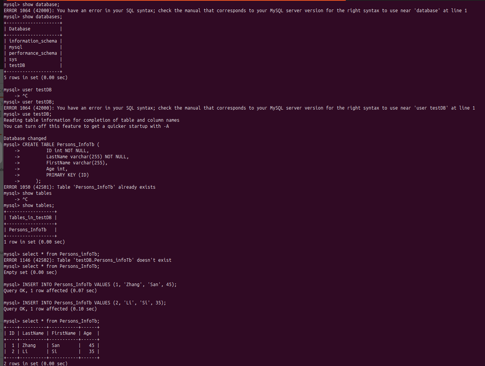
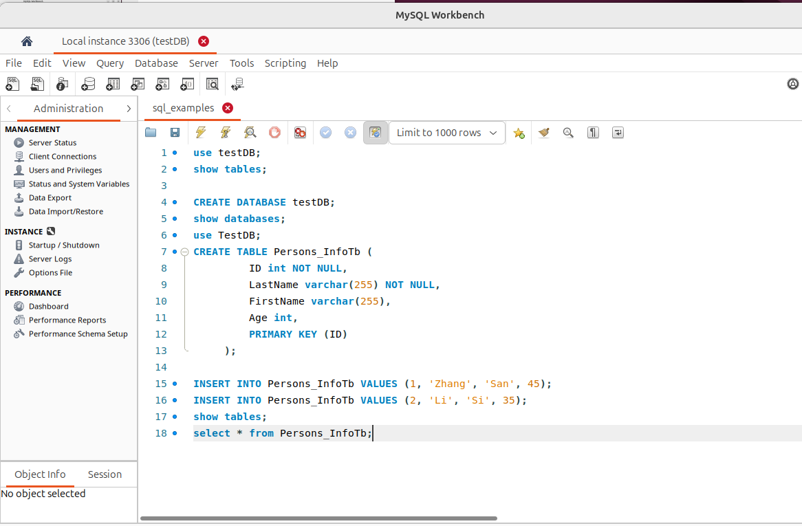

# Command of MySQL

## Set Up MySql

### Install Mysql Client 
```
sudo apt install mysql-client
```
### GUI Client MySQl Workbench

GUI tools please refer to [Workbench](https://www.mysql.com/products/workbench)

[Download Workbench](https://dev.mysql.com/downloads/workbench) and install it

Install WorkBench 

`sudo dpkg -i mysql-workbench-community_8.0.42-1ubuntu24.04_amd64.deb `

* Fix install dependency if there is error
```
sudo apt-get install -f
sudo dpkg -i mysql-workbench-community_8.0.42-1ubuntu24.04_amd64.deb 
```
**Note Remove package by the command**: `sudo dpkg -r mysql-workbench-community-dbgsym`

### Start Database Server

```
cd agent-examples/docker_compose/
docker compose -f compose_db.yaml up -d
```

## Connect to MySql Server 

```
mysql --host=127.0.0.1 --port=3306 -u root -p
```


or

Workbench: 
Start `MySql Workbench`


## Sql Command



```
CREATE DATABASE testDB;
show databases;
use testDB;
CREATE TABLE Persons_InfoTb (
         ID int NOT NULL,
         LastName varchar(255) NOT NULL,
         FirstName varchar(255),
         Age int,
         PRIMARY KEY (ID)
     );

INSERT INTO Persons_InfoTb VALUES (1, 'Zhang', 'San', 45);
INSERT INTO Persons_InfoTb VALUES (2, 'Li', 'Si', 35);
show tables;
select * from Persons;
```
