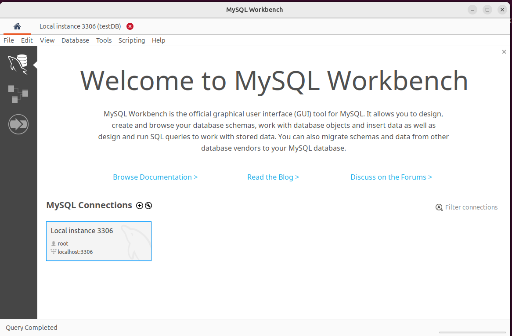
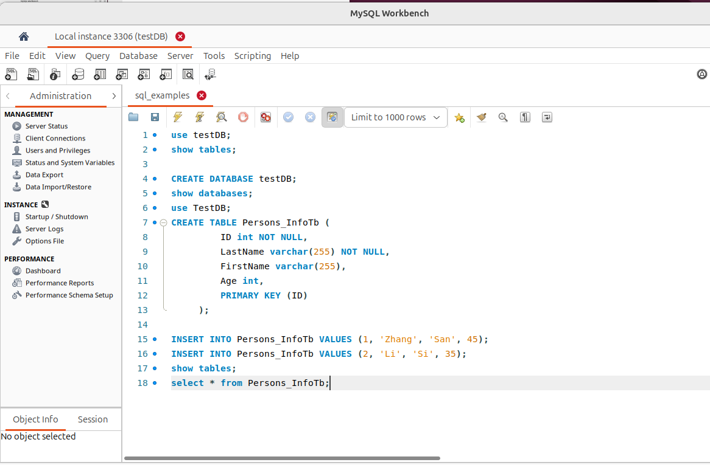

# Command of MySQL

## Set Up MySql

### Install Mysql Client 
```
sudo apt install mysql-client
```
### GUI Client MySQl Workbench

GUI Tools [Workbench](https://www.mysql.com/products/workbench)
[Download Workbench](https://dev.mysql.com/downloads/workbench) and install it

Install WorkBench and fix install dependency

`sudo dpkg -i mysql-workbench-community_8.0.42-1ubuntu24.04_amd64.deb `

```
Selecting previously unselected package mysql-workbench-community.
(Reading database ... 225792 files and directories currently installed.)
Preparing to unpack mysql-workbench-community_8.0.42-1ubuntu24.04_amd64.deb ...
Unpacking mysql-workbench-community (8.0.42-1ubuntu24.04) ...
dpkg: dependency problems prevent configuration of mysql-workbench-community:
 mysql-workbench-community depends on libatkmm-1.6-1v5 (>= 2.28.4); however:
  Package libatkmm-1.6-1v5 is not installed.
 mysql-workbench-community depends on libglibmm-2.4-1t64 (>= 2.66.7); however:
  Package libglibmm-2.4-1t64 is not installed.
 mysql-workbench-community depends on libgtkmm-3.0-1t64 (>= 3.24.9); however:
  Package libgtkmm-3.0-1t64 is not installed.
 mysql-workbench-community depends on libmysqlclient21 (>= 8.0.11); however:
  Package libmysqlclient21 is not installed.
 mysql-workbench-community depends on libodbc2 (>= 2.3.1); however:
  Package libodbc2 is not installed.
 mysql-workbench-community depends on libproj25 (>= 9.4.0); however:
  Package libproj25 is not installed.
 mysql-workbench-community depends on libsigc++-2.0-0v5 (>= 2.8.0); however:
  Package libsigc++-2.0-0v5 is not installed.
 mysql-workbench-community depends on libzip4t64 (>= 0.10); however:
  Package libzip4t64 is not installed.

dpkg: error processing package mysql-workbench-community (--install):
 dependency problems - leaving unconfigured
Processing triggers for gnome-menus (3.36.0-1.1ubuntu3) ...
Processing triggers for desktop-file-utils (0.27-2build1) ...
Processing triggers for hicolor-icon-theme (0.17-2) ...
Processing triggers for shared-mime-info (2.4-4) ...
Errors were encountered while processing:
 mysql-workbench-community
```

```
sudo apt-get install -f
sudo dpkg -i mysql-workbench-community_8.0.42-1ubuntu24.04_amd64.deb 
```
**Note Remove package by the command**: `sudo dpkg -r mysql-workbench-community-dbgsym`

### Start Database Server

```
cd agent-examples/docker_compose/
docker compose -f compose_db.yaml up -d
```

## Connect to MySql Server 

```
mysql --host=127.0.0.1 --port=9000 -u root -p
```
or

Workbench: 
Start `MySql Workbench`



## Sql Command



CREATE DATABASE testDB;
show databases;
use testDB;
CREATE TABLE Persons_InfoTb (
         ID int NOT NULL,
         LastName varchar(255) NOT NULL,
         FirstName varchar(255),
         Age int,
         PRIMARY KEY (ID)
     );

INSERT INTO Persons_InfoTb VALUES (1, 'Zhang', 'San', 45);
INSERT INTO Persons_InfoTb VALUES (2, 'Li', 'Si', 35);
show tables;
select * from Persons;
